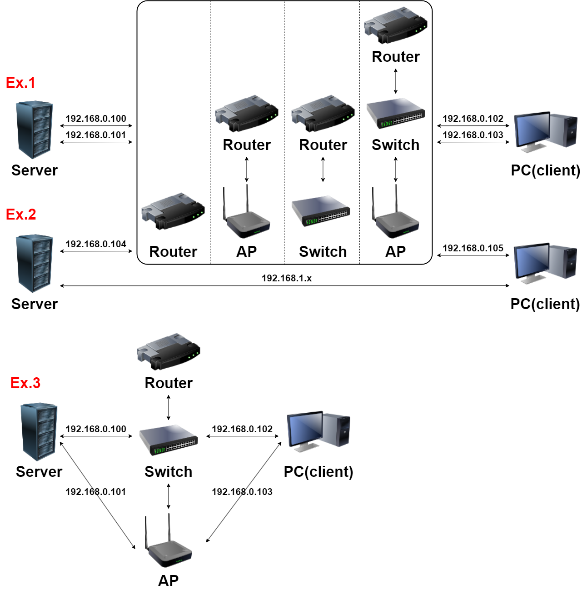

---

title: 'LinuxとWindowsのSMBマルチチャネル実装体験記'
date: 2025-08-04
permalink: /_notes_jp/2025/08/linux_windows_smb_multichannel/
tags:

* Linux
* Windows
* SMB
* マルチチャネル
* ネットワーク最適化

---

**Read this in other languages: [English](https://cc5103.github.io/ZHOUYUNHAO.github.io///_notes_en/2025/08/linux_windows_smb_multichannel/), [中文](https://cc5103.github.io/ZHOUYUNHAO.github.io///_notes/2025/08/linux_windows_smb_multichannel/), [日本語](https://cc5103.github.io/ZHOUYUNHAO.github.io///_notes_jp/2025/08/linux_windows_smb_multichannel/).**

# はじめに

新しく購入したサーバーに、なぜか3つのギガビットLANポートがプリインストールされていました。最初はゲートウェイ用途やネットワーク分離、冗長化など企業向けの目的かと思っていましたが、私の実際のニーズである「ローカルネットワークのファイル転送速度向上」にはまったく役立ちませんでした。そこで、これらの未使用のネットワークポートを活用する方法を模索し始めました。

調査の結果、主に以下の2つの方法があることが分かりました：

1. **リンクアグリゲーション（LACP）**
2. **SMBマルチチャネル（SMB Multichannel）**

どちらも複数のネットワークカードを使い帯域利用率を向上させますが、目的が異なります：

* **LACPは複数ユーザーが同時にサーバーにアクセスする場合に有効**で、複数ユーザーのファイルコピーが速度を妨げ合わないようにします。しかし、**単一ユーザーの帯域幅の制限は突破できません。**
* **SMBマルチチャネルは単一ユーザー向け**で、複数の物理経路で並列に通信できるため、**単一接続の転送速度を実質的に向上させる**ことができます。これがまさに私が求めていたものです。

本記事では、Linux（Debianを例に）とWindows間でSMBマルチチャネルを利用し高速転送を実現する手順と実装時の課題を記録します。多くはNASやWindows環境のみの例が多い中、DIYでLinuxサーバーを一から構築した私の実例を共有します。

---

# 目次

- [はじめに](#はじめに)
- [目次](#目次)
  - [リンクアグリゲーションとマルチチャネルの違い](#リンクアグリゲーションとマルチチャネルの違い)
    - [リンクアグリゲーション（LACP）](#リンクアグリゲーションlacp)
    - [SMBマルチチャネル](#smbマルチチャネル)
    - [比較まとめ](#比較まとめ)
  - [SMBの実装](#smbの実装)
    - [システム環境](#システム環境)
    - [Samba設定例](#samba設定例)
    - [適用方法](#適用方法)
  - [マルチチャネルの実現](#マルチチャネルの実現)
    - [接続パターン例](#接続パターン例)
    - [Windows側の設定と課題](#windows側の設定と課題)
      - [マルチチャネルの状態確認](#マルチチャネルの状態確認)
      - [USBネットワークアダプターでマルチチャネルが有効にならない問題](#usbネットワークアダプターでマルチチャネルが有効にならない問題)
  - [Linux側の設定と課題](#linux側の設定と課題)
    - [Linuxはデフォルトで**弱ホストモデル**](#linuxはデフォルトで弱ホストモデル)
    - [解決策：強ホストモード＋ポリシールーティング](#解決策強ホストモードポリシールーティング)
    - [ルーティング設定の詳細](#ルーティング設定の詳細)
      - [ネットワークインターフェース名とIP確認](#ネットワークインターフェース名とip確認)
      - [ポリシールーティング用スクリプト例（3ポート用）](#ポリシールーティング用スクリプト例3ポート用)
      - [スクリプトの有効化](#スクリプトの有効化)
  - [まとめ](#まとめ)

---

## リンクアグリゲーションとマルチチャネルの違い

### リンクアグリゲーション（LACP）

複数の物理ネットワークカードをリンクアグリゲーションプロトコル（802.3ad）で束ねて論理ポートとし、冗長性と帯域幅の合算を実現：

* 高並列・複数ユーザーがアクセスするサーバーに適している。
* 単一ユーザーの最大速度は単一リンク（例：1Gbps）に制限される。
* スイッチ側のLACP対応と設定が必要で、設定はやや複雑。

### SMBマルチチャネル

SMB 3.0で導入されたマルチチャネル機能により、1つのSMBセッションで複数のネットワーク経路を並列利用可能：

* **スイッチや専用ハードウェアは不要**
* **単一ユーザーの帯域を合算できる**
* USBネットワークアダプターなど多様なタイプのネットワークカードも利用可能
* 唯一の制約は**SMBプロトコル限定**

ローカルLAN内の単一ユーザーの転送速度を上げたい私のニーズにぴったり。

### 比較まとめ

| 特徴         | リンクアグリゲーション (LACP) | SMBマルチチャネル    |
| ---------- | ------------------ | ------------- |
| 対応プロトコル    | 全ネットワークプロトコル       | SMBプロトコル限定    |
| スイッチサポート必須 | 必須                 | 不要            |
| 設定の複雑さ     | 高い                 | 低い（Samba設定のみ） |
| 単一ユーザー速度向上 | なし                 | あり（複数経路の帯域合算） |
| 複数ユーザー効率   | 高い                 | 標準            |
| 冗長性        | 強い                 | 手動ルーティング設定に依存 |

---

## SMBの実装

### システム環境

* **サーバーOS**：Linux（Debian 12）
* **クライアントOS**：Windows 10 / 11
* **Sambaバージョン**：4.15以上推奨（`server multi channel support`対応必須）

### Samba設定例

```ini
[global]
   server min protocol = SMB3
   server max protocol = SMB3

   aio read size = 1
   aio write size = 1
   vfs objects = aio_pthread
   server multi channel support = yes

[SharedFolder]
   path = /mnt/your_shared_directory         ; 実際の共有フォルダパスに置換してください
   browseable = yes
   read only = no
   force user = your_linux_username          ; Linuxの実ユーザー名に置換してください
   create mask = 0777
   directory mask = 0777
   guest ok = no
   valid users = your_linux_username         ; 同上
   use sendfile = yes
   printable = no
```

> **補足：**
>
> * 共有フォルダは事前に作成し、権限は `chmod -R 777` または `chown` で調整してください。
> * ユーザー名はLinuxのログイン可能なユーザーで、`whoami` コマンドで確認可能です。
> * ファイアウォールを使用している場合はTCPポート445を開放してください。

### 適用方法

```bash
sudo systemctl restart smbd
```

共有の確認：

```bash
smbclient -L localhost -U your_linux_username
```

---

## マルチチャネルの実現

### 接続パターン例

主に3つの代表的なネットワークトポロジーがあります：

| パターン   | 説明                                 |
| ------ | ---------------------------------- |
| **例1** | 全てのポートが同一スイッチ、同一サブネットに接続           |
| **例2** | ポートごとに異なるサブネット設定、クライアントがどれか1つに直接接続 |
| **例3** | ポートごとに異なるスイッチに接続、同一サブネット内          |



### Windows側の設定と課題

#### マルチチャネルの状態確認

```powershell
Get-SmbMultichannelConnection
```

複数の `Client IP` と `Server IP` が表示されればマルチチャネルが有効です。

#### USBネットワークアダプターでマルチチャネルが有効にならない問題

私の経験では、USB接続のネットワークアダプターではマルチチャネルがほとんど動作しません。原因は：

* WindowsはRSS（Receive Side Scaling）対応ネットワークカードを優先使用する
* 多くのUSBネットワークアダプターはRSS非対応
* そのため、マルチチャネルが1ポートのみ利用され、他は無視される

**対策：**

1. デバイスマネージャーでRSS対応のネットワークカードのRSS機能を無効化する：

   * 該当カード → 詳細設定 → `Receive Side Scaling` または `RSS` → 無効化
2. 再起動して接続状況を再確認

その他確認事項：

* Windows 8以上のバージョンであること
* レジストリのSMBマルチチャネル有効化（`EnableMultiChannel=1`）
* ファイアウォールでTCP 445が通っていること
* ネットワークカード間で帯域幅の差が大きすぎないこと

---

## Linux側の設定と課題

私のLinuxサーバーは例1のトポロジーで、以下の深刻な問題に直面しました：

**アップロードとダウンロードの速度が著しく非対称**

* Windows → Linux：340MB/s（約3Gbps）まで出る
* Linux → Windows：120MB/s（約1Gbps）しか出ない

例2のトポロジー（リンクごとに独立サブネット）では問題ありませんでしたが、断線時のフェイルオーバーやインターネット接続の安定性を考えると例2構成は好ましくありません。調査を進めた結果、原因は：

### Linuxはデフォルトで**弱ホストモデル**

複数ポートで受信しても、返信パケットは常にデフォルトルートのポートから送出されるため、ボトルネックになります。

### 解決策：強ホストモード＋ポリシールーティング

受信したポートごとに返信も同じポートから返す設定にする。

---

### ルーティング設定の詳細

#### ネットワークインターフェース名とIP確認

```bash
ip link show          # 全インターフェース名確認
ip addr show          # 各インターフェースのIP確認
```

各インターフェースについてメモ：

* 名称（例：`eno1`, `enp1s0f0`, `enp1s0f1`）
* IPアドレス（例：`192.168.0.10`, `192.168.0.11`, `192.168.0.12`）
* サブネット（例：`192.168.0.0/24`）

#### ポリシールーティング用スクリプト例（3ポート用）

ファイル編集：`sudo nano /etc/NetworkManager/dispatcher.d/99-policy-routing`

```bash
#!/bin/bash

IFACE=$1
STATUS=$2

# ここは3ポート用の例です。以下の変数は実際のインターフェース名に置換してください。
TABLE_ENO1=100
TABLE_ENP1S0F0=101
TABLE_ENP1S0F1=102

if [ "$STATUS" = "up" ]; then
    # 192.168.0.0/24 は実際のサブネットに置換してください
    ip route show table $TABLE_ENO1 | grep -q "192.168.0.0/24" || ip route add 192.168.0.0/24 dev eno1 table $TABLE_ENO1
    ip route show table $TABLE_ENP1S0F0 | grep -q "192.168.0.0/24" || ip route add 192.168.0.0/24 dev enp1s0f0 table $TABLE_ENP1S0F0
    ip route show table $TABLE_ENP1S0F1 | grep -q "192.168.0.0/24" || ip route add 192.168.0.0/24 dev enp1s0f1 table $TABLE_ENP1S0F1

    # 以下のIPは各インターフェースの実IPに置換してください
    ip rule show | grep -q "from 192.168.0.10 lookup $TABLE_ENO1" || ip rule add from 192.168.0.10 lookup $TABLE_ENO1
    ip rule show | grep -q "from 192.168.0.11 lookup $TABLE_ENP1S0F0" || ip rule add from 192.168.0.11 lookup $TABLE_ENP1S0F0
    ip rule show | grep -q "from 192.168.0.12 lookup $TABLE_ENP1S0F1" || ip rule add from 192.168.0.12 lookup $TABLE_ENP1S0F1
fi
```

> ✳️ 置換まとめ：
>
> * `eno1`, `enp1s0f0`, `enp1s0f1` → `ip link show` で実際の名前を確認し置換
> * `192.168.0.0/24` → 実際のサブネットに置換（`ip route show`で確認）
> * `192.168.0.10/11/12` → 各インターフェースの実IP（`ip addr show`で確認）
> * ポートが1〜2個の場合は該当箇所のみ残せば良い

#### スクリプトの有効化

```bash
sudo chmod +x /etc/NetworkManager/dispatcher.d/99-policy-routing
```

ネットワーク再起動：

```bash
sudo systemctl restart NetworkManager
sudo ip route flush cache
```

動作確認：

```bash
ip rule show
ip route show table 100
ip route show table 101
```

---

## まとめ

SMBマルチチャネルは既存の複数ネットワークポート機器で**単一ユーザーのネットワーク性能を向上**させる、効率的で低コストな手法です。LACPに比べスイッチ依存せず設定も容易で、家庭や小規模サーバーに最適です。

実運用で遭遇した問題は：

* **USBネットワークアダプターのRSS非対応によるマルチチャネル失敗**
* **Linuxの弱ホストモデルによるアップロード速度低下**

Windows側でRSS無効化、Linux側で強ホストモード＋ポリシールーティング設定によりこれらを解決し、SMBマルチチャネルでのアップロード・ダウンロードの双方向帯域フル活用を実現しました。

複数ポート搭載のサーバーでローカル転送速度を上げたい方に、この経験が役立てば幸いです。
