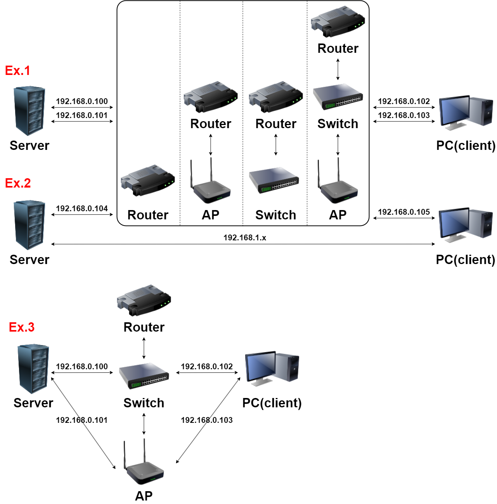

**Read this in other languages: [English](https://cc5103.github.io/ZHOUYUNHAO.github.io/_notes/2025/08/linux-windows-smb-multichannel/), [中文](https://cc5103.github.io/ZHOUYUNHAO.github.io/_notes_zh/2025/08/linux-windows-smb-multichannel/), [日本語](https://cc5103.github.io/ZHOUYUNHAO.github.io/_notes_jp/2025/08/linux-windows-smb-multichannel/).**

# 前述

我新买的服务器，不知道为什么预装了3个千兆网口。起初以为是拿来做网关用，或是为了网络隔离、故障冗余等企业用途，结果我发现这玩意儿对我实际需求——“提高局域网文件传输速率”——毫无帮助。于是我开始琢磨，怎么把这些原本闲着的网口用起来。

调研下来发现有两种主流方案：

1. **链路聚合（LACP）**
2. **SMB多通道（SMB Multichannel）**

两者都能用多张网卡来提高带宽使用率，但方向不同：

* **LACP适合多人同时访问服务器**，例如多个用户拷贝文件时不会互相拖慢速度。但它无法让**单个用户**突破单个网卡带宽的限制。
* **SMB多通道针对单一用户**，可以在多个物理链路上并行传输，从而**实质提升单连接的传输速率**，这正是我想要的。

本文围绕 Linux（以 Debian 为例） 与 Windows 之间如何通过 SMB 多通道达成高效传输，记录实装过程与踩坑细节。网上多是 NAS 或全 Windows 系环境的例子，而我是从零搭建的 DIY Linux 服务器，这里分享更贴近实际自建场景。

---

# 目录

- [前述](#前述)
- [目录](#目录)
  - [链路聚合与多通道的不同](#链路聚合与多通道的不同)
    - [链路聚合（LACP）](#链路聚合lacp)
    - [SMB多通道](#smb多通道)
    - [对比总结](#对比总结)
  - [SMB的实装](#smb的实装)
    - [系统环境](#系统环境)
    - [Samba 配置示例](#samba-配置示例)
    - [应用配置](#应用配置)
  - [多通道的实现](#多通道的实现)
    - [可用连接方式示意](#可用连接方式示意)
    - [Windows端配置与问题](#windows端配置与问题)
      - [多通道状态查看](#多通道状态查看)
      - [USB网卡无法启用多通道的问题](#usb网卡无法启用多通道的问题)
  - [Linux端配置与问题](#linux端配置与问题)
    - [Linux默认为**弱主机模型**](#linux默认为弱主机模型)
    - [解决方法：强主机模式 + 策略路由](#解决方法强主机模式--策略路由)
    - [路由配置详解](#路由配置详解)
      - [查看网口名称与 IP](#查看网口名称与-ip)
      - [策略路由脚本示例（适用于3个网口）](#策略路由脚本示例适用于3个网口)
      - [启用脚本](#启用脚本)
  - [总结](#总结)

---

## 链路聚合与多通道的不同

### 链路聚合（LACP）

通过链路聚合协议（802.3ad）将多张物理网卡绑成一个逻辑网口，从而实现冗余与带宽叠加：

* 适合高并发、多用户的服务器使用场景。
* 单个用户的最大速度仍然受限于单链路（例如 1Gbps）。
* 需要交换机支持 LACP，且配置略复杂。

### SMB多通道

SMB 3.0 引入的多通道功能，允许一个 SMB 会话通过多个网络路径并行传输：

* **不依赖交换机或特殊硬件**
* **单用户带宽可叠加**
* 多种类型的网卡（包括 USB 网卡）都可参与
* 唯一限制：**只对 SMB 协议有效**

非常适合我这种希望提升**单用户本地局域网拷贝速度**的人。

### 对比总结

| 特性       | 链路聚合 (LACP) | SMB 多通道      |
| -------- | ----------- | ------------ |
| 支持协议     | 所有网络协议      | 仅 SMB 协议     |
| 是否需交换机支持 | 是           | 否            |
| 配置复杂度    | 高           | 低（只需配置Samba） |
| 单用户提速    | 否           | 是（多链路叠加）     |
| 多用户效率    | 高           | 一般           |
| 容错能力     | 强           | 依赖手动路由配置     |

---

## SMB的实装

### 系统环境

* **服务器系统**：Linux（Debian 12）
* **客户端系统**：Windows 10 / 11
* **Samba版本**：建议 4.15+（必须支持 `server multi channel support`）

### Samba 配置示例

```ini
[global]
   server min protocol = SMB3
   server max protocol = SMB3

   aio read size = 1
   aio write size = 1
   vfs objects = aio_pthread
   server multi channel support = yes

[SharedFolder]
   path = /mnt/your_shared_directory         ; 替换为你的实际目录路径
   browseable = yes
   read only = no
   force user = your_linux_username          ; 替换为Linux本地用户名
   create mask = 0777
   directory mask = 0777
   guest ok = no
   valid users = your_linux_username         ; 同上
   use sendfile = yes
   printable = no
```

> **说明：**
>
> * 共享目录需预先存在，权限可用 `chmod -R 777` 或 `chown` 配置。
> * 用户名为 Linux 本地可登录用户，可用 `whoami` 查询当前用户。
> * 若配置了防火墙，需开放 TCP 445 端口。

### 应用配置

```bash
sudo systemctl restart smbd
```

检查共享是否可访问：

```bash
smbclient -L localhost -U your_linux_username
```

---

## 多通道的实现

### 可用连接方式示意

可行的多通道配置方案有三种典型拓扑结构：

| 拓扑       | 描述                      |
| -------- | ----------------------- |
| **EX.1** | 所有网口接入同一个交换机，位于同一子网     |
| **EX.2** | 每个网口配置不同子网，客户端与其中一个端口直连 |
| **EX.3** | 不同网口接入不同交换机，位于同一子网  |



### Windows端配置与问题

#### 多通道状态查看

```powershell
Get-SmbMultichannelConnection
```

如果你看到多个 `Client IP` 和 `Server IP`，说明已启用多通道。

#### USB网卡无法启用多通道的问题

我的经验是，使用 USB 网卡时，多通道根本不起作用，尽管网卡已接好、驱动已装好。排查发现：

* Windows 会**优先使用支持 RSS（接收端缩放）的网卡**
* 大多数 USB 网卡 **不支持 RSS**
* 导致多通道只用了一个网口，其他被忽略

**解决方法：**

1. 在设备管理器中，**禁用支持 RSS 的网卡的 RSS 功能**：

   * 找到该网卡 → 高级 → `Receive Side Scaling` 或 `RSS` → 设置为 `Disabled`
2. 重启后重新检查连接状态

此外还需确认：

* Windows 版本 >= Windows 8
* 注册表启用了 SMB 多通道（`EnableMultiChannel=1`）
* 没有防火墙阻挡 TCP 445
* 网卡带宽不能差异过大

---

## Linux端配置与问题

我的Linux服务器在拓扑 Ex.1 场景下遇到一个令人崩溃的问题：

**上传和下载速率极度不对称**。

* Windows 向 Linux 传：可跑满 340MB/s（约 3Gbps）
* Linux 向 Windows 传：只有 120MB/s（约 1Gbps）

这个问题在 Ex.2（每条链路独立子网）下没有，但我不甘心。因为 Ex.2 的结构**不支持断网切换、影响互联网访问稳定性**。我开始深入查原因。

最终确认：

### Linux默认为**弱主机模型**

这意味着即使从多个网口收到了数据，**回包也会统一从默认路由口发出**，导致流量瓶颈，影响了上传速率。

### 解决方法：强主机模式 + 策略路由

要实现每个网口收哪个IP的包，就从该网口回发。

---

### 路由配置详解

#### 查看网口名称与 IP

```bash
ip link show          # 查看所有网卡名称
ip addr show          # 查看各网卡IP地址
```

记录各个网口的：

* 名称（如 `eno1`, `enp1s0f0`, `enp1s0f1`）
* IP 地址（如 `192.168.0.10`, `192.168.0.11`, `192.168.0.12`）
* 所在子网（如 `192.168.0.0/24`）

#### 策略路由脚本示例（适用于3个网口）

编辑：`sudo nano /etc/NetworkManager/dispatcher.d/99-policy-routing`

```bash
#!/bin/bash

IFACE=$1
STATUS=$2

# 这段为三网口的示例，请将以下变量替换为你的实际网卡名
TABLE_ENO1=100
TABLE_ENP1S0F0=101
TABLE_ENP1S0F1=102

if [ "$STATUS" = "up" ]; then
    # 替换 192.168.0.0/24 为你的实际子网段
    ip route show table $TABLE_ENO1 | grep -q "192.168.0.0/24" || ip route add 192.168.0.0/24 dev eno1 table $TABLE_ENO1
    ip route show table $TABLE_ENP1S0F0 | grep -q "192.168.0.0/24" || ip route add 192.168.0.0/24 dev enp1s0f0 table $TABLE_ENP1S0F0
    ip route show table $TABLE_ENP1S0F1 | grep -q "192.168.0.0/24" || ip route add 192.168.0.0/24 dev enp1s0f1 table $TABLE_ENP1S0F1

    # 替换以下 IP 为各网卡的实际 IP 地址
    ip rule show | grep -q "from 192.168.0.10 lookup $TABLE_ENO1" || ip rule add from 192.168.0.10 lookup $TABLE_ENO1
    ip rule show | grep -q "from 192.168.0.11 lookup $TABLE_ENP1S0F0" || ip rule add from 192.168.0.11 lookup $TABLE_ENP1S0F0
    ip rule show | grep -q "from 192.168.0.12 lookup $TABLE_ENP1S0F1" || ip rule add from 192.168.0.12 lookup $TABLE_ENP1S0F1
fi
```

> ✳️ 替换说明总结：
>
> * `eno1`, `enp1s0f0`, `enp1s0f1`：替换为你系统中实际网卡名称（使用 `ip link show` 查看）
> * `192.168.0.0/24`：替换为网口所在子网（用 `ip route show` 查看）
> * `192.168.0.10/11/12`：替换为每个网口的实际 IP 地址（用 `ip addr show` 查看）
> * 如果只有 1 或 2 个网口，只保留相关部分即可

#### 启用脚本

```bash
sudo chmod +x /etc/NetworkManager/dispatcher.d/99-policy-routing
```

重启网络：

```bash
sudo systemctl restart NetworkManager
sudo ip route flush cache
```

验证：

```bash
ip rule show
ip route show table 100
ip route show table 101
```

---

## 总结

SMB 多通道是一种高效、低成本的方式，适合在已有多网口设备上**提升单用户的网络性能**。相比 LACP，它不依赖交换机，配置门槛低，非常适合家用或小型服务器场景。

实战中我遇到：

* **USB 网卡不支持 RSS 导致多通道失败**
* **Linux 弱主机模式导致上传瓶颈**

最后通过禁用 Windows RSS、Linux 配置强主机+策略路由解决了这些问题，真正实现了 SMB 多通道上传与下载**双向跑满带宽**的目标。

如果你也有多网口服务器，想提升局域网传输速率，这篇经验希望对你有用。